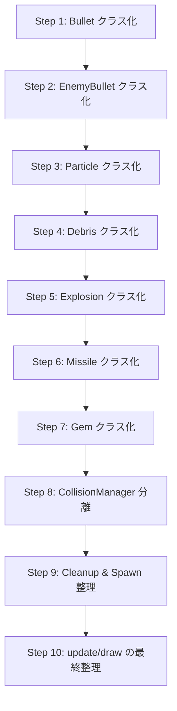

# Phase 4 実装計画書：エンティティクラス化 & Collision 分離

**対象バージョン**: v0.5.31 → Phase 4 完了まで  
**前提**: Phase 3 完了済み。main.js 約 2,500 行。  
**絶対原則**: リファクタリングのみ。ゲーム挙動の変更は一切行わない。

---

## 現状分析

### main.js に残存する責務（移植対象）

| カテゴリ | 行範囲（概算） | 行数 | 内容 |
|---|---|---|---|
| Entity 定義 | L990–L1081 | ~90 | `entities` オブジェクト、`spawnDebris`、`spawnDeathDebris`、`spawnExplosion` |
| Debris update + collision | L1190–L1322 | ~130 | デブリの物理更新・煙生成・対Player衝突・対Enemy衝突 |
| Explosion update + collision | L1325–L1392 | ~70 | 爆発のアニメ計算・対Player爆風・対Enemy爆風 |
| Bullet update | L1395–L1399 | ~5 | 自機弾の位置更新・寿命管理 |
| EnemyBullet update + collision | L1402–L1437 | ~35 | 敵弾の位置更新・対Player衝突・ミサイル撃墜 |
| Missile update + collision | L1440–L1521 | ~80 | ミサイルのホーミング・物理・煙生成・対Enemy衝突・Sub-Munition |
| Enemy spawn | L1523–L1591 | ~70 | 母艦からのスポーン制御 |
| Enemy-Enemy collision | L1593–L1642 | ~50 | 敵同士の衝突物理 |
| Enemy update + PlayerBullet collision + Body collision | L1644–L1743 | ~100 | 敵AIループ・弾衝突・体当たり・生存チェック |
| Mothership collision | L1745–L1845 | ~100 | 母艦 vs 弾/ミサイル/体当たり |
| Gem update | L1847–L1883 | ~35 | ジェムの吸引・回収 |
| Trail update | L1942–L2049 | ~110 | プレイヤー・敵機のトレイル更新 |
| draw 内 entity 描画 | L2332–L2471 | ~140 | `drawGameEntities` |

**合計**: 約 1,015 行が移植対象

### 既存ファイル構成

```
js/
├── classes/        Ship.js, PlayerShip.js, EnemyShip.js, communication.js
├── data/           config.js, constants.js, stats.js, upgradePool.js
├── renderers/      drawBackground.js, drawEffects.js, drawHUD.js, drawOverlay.js
├── scenes/         TitleScene.js, ResultScene.js
├── systems/        effects.js, eliminator.js, handleInput.js, hud.js, init.js, input.js, map.js, radar.js
├── utils/          asset.js, utils.js
├── changelog.js
└── main.js
```

> [!IMPORTANT]
> 現在 `js/classes/Ship.js`, `PlayerShip.js`, `EnemyShip.js` は空ファイルであり、index.html でもコメントアウト（L41–L43）されています。
> クラス定義は **すべて main.js 内**（L202–L983）に存在します。
> Phase 4 ではクラスの外部ファイル化は行わず、**新規エンティティクラスのみ** を `js/classes/` 配下に新設します。

---

## Step 全体マップ



---

## エンティティクラス化の最適な順序（分析）

> [!TIP]
> **最も安全な順序 = 依存関係が少ない → 多い** の順にクラス化すること。
>
> - **Bullet** (依存ゼロ: 移動 + 寿命のみ)
> - **EnemyBullet** (Bullet と同等 + damage プロパティ)
> - **Particle** (移動 + 寿命のみ、既に EffectManager が管理)
> - **Debris** (移動 + 寿命 + 煙生成。衝突判定は main.js に残す)
> - **Explosion** (アニメ計算。衝突判定は main.js に残す)
> - **Missile** (ホーミング + 煙生成 + 複雑な物理。衝突判定は main.js に残す)
> - **Gem** (吸引物理 + 回収)
>
> Collision 分離は **全エンティティのクラス化完了後** に行う。
> Cleanup 整理は Collision 分離と同時に行う（同一ループ内にあるため）。

---

## Step 1: Bullet クラス化

### 作業内容
- `js/classes/Bullet.js` を新規作成
- `Bullet` クラスに `constructor(x, y, vx, vy, life, isScatter)` と `update()` を実装
- `update()` は `x += vx; y += vy; life--;` のみ（現行 L1396–L1398 と同一）
- main.js の `entities.bullets.push({ ... })` を `new Bullet(...)` に置換（PlayerShip.update 内 L640–L647, L1660–L1667, L1759–L1766）
- main.js L1395–L1399 の弾更新ループを `b.update()` 呼び出しに置換
- index.html に `<script src="js/classes/Bullet.js">` を追加

### 変更対象ファイル
- `js/classes/Bullet.js` [NEW]
- `js/main.js` (push 箇所を new Bullet() に変更、update ループ簡略化)
- `index.html` (script 追加)

### main.js から削除される責務
- Bullet の物理更新ロジック（3 行）

### 動作確認項目
- [ ] バルカン射撃が正常に動作する
- [ ] 弾の移動速度・寿命・消滅タイミングが変わらない
- [ ] Scatter Shot (bulletCount >= 6) が正常に動作する
- [ ] 敵母艦への弾も正常に機能する

### 想定リスク
- **低**: `isScatter` プロパティの欠落による Scatter Shot 機能不全
- **低**: push 箇所の見落とし

### ロールバック時の影響範囲
- `Bullet.js` を削除、main.js の push 箇所を元のオブジェクトリテラルに戻す

### 次 Step へ進む条件
- バルカン射撃・Scatter Shot・母艦への射撃が全て正常動作

### 推定難易度: ★☆☆☆☆（最も簡単）
### 推定リスク: ★☆☆☆☆（最も低い）

---

## Step 2: EnemyBullet クラス化

### 作業内容
- `js/classes/EnemyBullet.js` を新規作成
- `EnemyBullet` クラスに `constructor(x, y, vx, vy, life, damage)` と `update()` を実装
- `update()` は `x += vx; y += vy; life--;` のみ（現行 L1403–L1404 と同一）
- main.js の `entities.enemyBullets.push({ ... })` を `new EnemyBullet(...)` に置換（EnemyShip.update 内 L968–L975）
- main.js L1402–L1404 の敵弾更新部分を `b.update()` 呼び出しに置換
- **衝突判定（対Player・対Missile）は main.js に残す**
- index.html に `<script src="js/classes/EnemyBullet.js">` を追加

### 変更対象ファイル
- `js/classes/EnemyBullet.js` [NEW]
- `js/main.js` (push 箇所を new EnemyBullet() に変更、update 部分を b.update() に)
- `index.html` (script 追加)

### main.js から削除される責務
- EnemyBullet の物理更新ロジック（2 行）

### 動作確認項目
- [ ] 敵の射撃が正常に動作する
- [ ] 敵弾が自機に当たった際のダメージ・演出が正常
- [ ] 敵弾がミサイルに当たった際の撃墜判定が正常
- [ ] 敵弾の消滅タイミングが変わらない

### 想定リスク
- **低**: damage プロパティの初期値ミスによるダメージ量変化

### ロールバック時の影響範囲
- `EnemyBullet.js` を削除、push 箇所を元のオブジェクトリテラルに戻す

### 次 Step へ進む条件
- 敵弾の発射・移動・ダメージ・ミサイル撃墜が全て正常動作

### 推定難易度: ★☆☆☆☆
### 推定リスク: ★☆☆☆☆

---

## Step 3: Particle クラス化

### 作業内容
- `js/classes/Particle.js` を新規作成
- `Particle` クラスに各種パーティクルタイプ（SPARK, SMOKE, DEBRIS_SMOKE, CROSS, LEVEL_UP_HIT_PARTICLE 等）の共通プロパティを持つコンストラクタと `update()` を実装
- `update()` は現行 EffectManager.update 内 L15–L21 と同一の処理
- main.js 内の全 `entities.particles.push({ ... })` を `new Particle(...)` に置換
- `js/systems/effects.js` の EffectManager.update を `p.update()` 呼び出しに置換
- index.html に `<script src="js/classes/Particle.js">` を追加

### 変更対象ファイル
- `js/classes/Particle.js` [NEW]
- `js/main.js` (各所の push を new Particle() に変更)
- `js/systems/effects.js` (update ループ簡略化)
- `index.html` (script 追加)

### main.js から削除される責務
- なし（Particle の update は既に EffectManager に移植済み）

### 動作確認項目
- [ ] タクティカルブレーキの火花パーティクルが正常に表示される
- [ ] デブリの煙パーティクルが正常に表示される
- [ ] ミサイルの噴煙が正常に表示される
- [ ] オートリペアの十字パーティクルが正常
- [ ] レベルアップ決定時のパーティクルが正常
- [ ] 全パーティクルの寿命・サイズ・透明度が変わらない

### 想定リスク
- **中**: パーティクル生成箇所が多い（main.js に 8 箇所以上）。1 箇所でもプロパティの引き渡し漏れがあると演出が崩れる
- **低**: `type` プロパティの判定漏れ

### ロールバック時の影響範囲
- `Particle.js` を削除、push 箇所を元に戻す、EffectManager.update を元に戻す

### 次 Step へ進む条件
- 全種類のパーティクルが正常に表示・消滅する

### 推定難易度: ★★☆☆☆
### 推定リスク: ★★☆☆☆

---

## Step 4: Debris クラス化

### 作業内容
- `js/classes/Debris.js` を新規作成
- `Debris` クラスに `constructor(x, y, vx, vy, color, size, life, decay, harmful)` と `update()` を実装
- `update()` は位置更新 + 寿命減衰 + 煙パーティクル生成（現行 L1191–L1209）のみ
- **衝突判定（対Player・対Enemy）は main.js に残す**
- main.js の `spawnDebris()` と `spawnDeathDebris()` 内の push を `new Debris(...)` に置換
- main.js のデブリ更新ループ（L1190–L1209）から物理更新部分を `d.update()` 呼び出しに置換
- index.html に `<script src="js/classes/Debris.js">` を追加

### 変更対象ファイル
- `js/classes/Debris.js` [NEW]
- `js/main.js` (spawnDebris / spawnDeathDebris 内の push を new Debris() に変更、update ループの物理部分を d.update() に)
- `index.html` (script 追加)

### main.js から削除される責務
- Debris の物理更新ロジック（位置更新 + 煙生成: 約 20 行）

### 動作確認項目
- [ ] 被弾時の小破片が正常に表示される
- [ ] 爆破時の有害デブリが正常に表示され、煙を噴出する
- [ ] デブリの衝突判定（自機・敵機）が正常に動作する
- [ ] デブリの寿命・消滅タイミングが変わらない

### 想定リスク
- **中**: 煙パーティクル生成を `update()` に移す際、`entities.particles` への参照が必要。引数設計を誤るとパーティクルが生成されない
- **低**: `harmful` フラグの欠落

### ロールバック時の影響範囲
- `Debris.js` を削除、spawnDebris / spawnDeathDebris を元に戻す、update ループを元に戻す

### 次 Step へ進む条件
- 全種類のデブリの生成・移動・煙生成・衝突・消滅が正常動作

### 推定難易度: ★★☆☆☆
### 推定リスク: ★★☆☆☆

---

## Step 5: Explosion クラス化

### 作業内容
- `js/classes/Explosion.js` を新規作成
- `Explosion` クラスに `constructor(...)` と `update()` を実装
- `update()` は timer 減算 + アニメ推移計算（scale, shake）のみ（現行 L1327–L1348）
- **爆風ダメージ判定は main.js に残す**
- `spawnExplosion()` 関数内の push を `new Explosion(...)` に置換
- main.js の爆発更新ループ（L1325–L1348）からアニメ計算部分を `exp.update()` 呼び出しに置換
- index.html に `<script src="js/classes/Explosion.js">` を追加

### 変更対象ファイル
- `js/classes/Explosion.js` [NEW]
- `js/main.js` (spawnExplosion 内の push を new Explosion() に変更、update ループのアニメ計算を exp.update() に)
- `index.html` (script 追加)

### main.js から削除される責務
- Explosion のアニメ推移計算ロジック（scale, shake, progress: 約 20 行）

### 動作確認項目
- [ ] 敵撃破時の爆発が正常に表示される
- [ ] 爆発の拡大→維持→縮小アニメが変わらない
- [ ] 爆風ダメージが正常に適用される（自機・敵機）
- [ ] 自機爆発時のゲームオーバー遷移が正常
- [ ] ミサイルフレアが正常に動作する
- [ ] タイトル画面の背景爆発が正常

### 想定リスク
- **中**: `currentScale` を `update()` 内でセットした後に main.js の衝突判定で参照するため、`update()` が先に呼ばれることを保証する必要がある（既存の処理順と同一にする）
- **中**: `damagedEntities` (Set) のインスタンス化が new Explosion() の constructor 内で正しく行われるか確認が必要

### ロールバック時の影響範囲
- `Explosion.js` を削除、spawnExplosion を元に戻す、update ループを元に戻す

### 次 Step へ進む条件
- 全種類の爆発（通常/自機/フレーバー/ミサイルフレア）のアニメ・ダメージ・遷移が正常動作

### 推定難易度: ★★★☆☆
### 推定リスク: ★★★☆☆

---

## Step 6: Missile クラス化

### 作業内容
- `js/classes/Missile.js` を新規作成
- `Missile` クラスに `constructor(...)` と `update(entities)` を実装
- `update()` にはホーミング処理 + 物理演算 + 噴煙パーティクル生成を含む（現行 L1441–L1477）
- **衝突判定（対Enemy・Sub-Munition 生成）は main.js に残す**
- ターゲットロスト時の `life` 制限（L1442–L1443）も `update()` に含める
- main.js の `entities.missiles.push({ ... })` を `new Missile(...)` に置換（PlayerShip.update 内 L691–L703, Sub-Munition L1505–L1516, L1793–L1804）
- main.js のミサイル更新ループ（L1440–L1477）から物理更新部分を `m.update(entities)` 呼び出しに置換
- index.html に `<script src="js/classes/Missile.js">` を追加

### 変更対象ファイル
- `js/classes/Missile.js` [NEW]
- `js/main.js` (push 箇所を new Missile() に変更、update ループの物理部分を m.update() に)
- `index.html` (script 追加)

### main.js から削除される責務
- Missile の物理更新 + ホーミング + 噴煙生成ロジック（約 35 行）

### 動作確認項目
- [ ] ミサイル発射が正常に動作する
- [ ] ホーミングが正常に機能する（前方 90 度以内のロックオン）
- [ ] ターゲットロスト時の早期自爆が正常
- [ ] ミサイルの噴煙パーティクルが正常
- [ ] 敵への命中 + 爆発が正常
- [ ] Sub-Munition（Multi-Missile, missile >= 6）が正常に動作する
- [ ] ミサイルの速度クランプが変わらない

### 想定リスク
- **中**: ホーミングの角度計算で `while` ループの正規化を忠実に移植する必要がある
- **中**: Sub-Munition 生成時に `new Missile(...)` を正しく構築する必要がある（`isSubMunition` フラグ）
- **低**: `entities.particles` への参照渡し

### ロールバック時の影響範囲
- `Missile.js` を削除、push 箇所を元に戻す、update ループを元に戻す

### 次 Step へ進む条件
- ミサイルの全機能（発射・ホーミング・噴煙・命中・フレア・Sub-Munition）が正常動作

### 推定難易度: ★★★☆☆
### 推定リスク: ★★★☆☆

---

## Step 7: Gem クラス化

### 作業内容
- `js/classes/Gem.js` を新規作成
- `Gem` クラスに `constructor(...)` と `update(playerX, playerY)` を実装
- `update()` には吸引判定 + マグネット加速 + 飛び出し減速（現行 L1849–L1872）を含む
- **回収判定（dist < GEM_COLLECT_RADIUS）と回収時の効果適用は main.js に残す**
- `js/systems/eliminator.js` の `spawnItem()` 内の push を `new Gem(...)` に置換
- main.js のジェム更新ループ（L1847–L1883）から物理更新部分を `g.update(player.x, player.y)` 呼び出しに置換
- index.html に `<script src="js/classes/Gem.js">` を追加

### 変更対象ファイル
- `js/classes/Gem.js` [NEW]
- `js/main.js` (update ループの物理部分を g.update() に)
- `js/systems/eliminator.js` (push を new Gem() に変更)
- `index.html` (script 追加)

### main.js から削除される責務
- Gem の物理更新ロジック（吸引 + 減速: 約 20 行）

### 動作確認項目
- [ ] 敵撃破時にジェムが飛び散る
- [ ] ジェムの吸引範囲に入るとロックオンし加速する
- [ ] ジェムの回収判定が正常（EXP 加算 / HP 回復）
- [ ] 大 EXP ジェム・回復アイテムが正常に動作する
- [ ] 母艦撃破時のアイテムドロップが正常

### 想定リスク
- **低**: `locked` フラグや `speed` の初期値ミス
- **低**: `eliminator.js` が main.js より先に読み込まれるため、`Gem` クラスが先にロードされている必要がある（index.html のスクリプト順序を確認）

### ロールバック時の影響範囲
- `Gem.js` を削除、eliminator.js と main.js の push/update を元に戻す

### 次 Step へ進む条件
- 全種類のジェムの生成・飛散・吸引・回収が正常動作

### 推定難易度: ★★☆☆☆
### 推定リスク: ★★☆☆☆

---

## Step 8: CollisionManager 分離

> [!IMPORTANT]
> これが Phase 4 で **最も難易度・リスクが高い** ステップです。
> CollisionManager は汎用衝突システムを作るものではなく、現在のカテゴリ構造を完全維持したまま、コードを関数へ移動します。

### 作業内容
- `js/systems/collision.js` を新規作成
- `CollisionManager` オブジェクトに以下のメソッドを実装（現行の処理順序を完全維持）:

| メソッド名 | 移植元 (main.js) | 内容 |
|---|---|---|
| `handleDebrisVsPlayer()` | L1211–L1260 | 有害デブリ vs 自機 |
| `handleDebrisVsEnemy()` | L1262–L1313 | 有害デブリ vs 敵機 |
| `handleExplosionVsPlayer()` | L1354–L1363 | 爆風 vs 自機 |
| `handleExplosionVsEnemy()` | L1365–L1383 | 爆風 vs 敵機 |
| `handleEnemyBulletVsPlayer()` | L1402–L1418 | 敵弾 vs 自機 |
| `handleEnemyBulletVsMissile()` | L1420–L1434 | 敵弾 vs ミサイル |
| `handleMissileVsEnemy()` | L1479–L1521 | ミサイル vs 敵機 (+ Sub-Munition) |
| `handleEnemyVsEnemy()` | L1593–L1642 | 敵同士の衝突物理 |
| `handlePlayerBulletVsEnemy()` | L1650–L1688 | 自機弾 vs 敵機 |
| `handlePlayerVsEnemy()` | L1690–L1736 | 自機 vs 敵機 体当たり |
| `handleMothershipVsBullet()` | L1750–L1773 | 母艦 vs 自機弾 |
| `handleMothershipVsMissile()` | L1775–L1809 | 母艦 vs ミサイル |
| `handleMothershipVsPlayer()` | L1811–L1840 | 母艦 vs 自機体当たり |
| `handleGemPickup()` | L1874–L1882 | ジェム回収 |

- main.js の各衝突判定ブロックを対応する `CollisionManager.handleXxx(...)` 呼び出しに置換
- **呼び出し順序は現行 update() 内の順序を完全維持する**
- index.html に `<script src="js/systems/collision.js">` を追加

> [!WARNING]
> 各メソッドには `player`, `entities`, `GAME`, `playerStats`, `CONFIG` 等のグローバル変数を引数またはグローバル参照で渡す必要があります。
> 現在のコードベースではグローバル変数として直接アクセスしているため、同じパターンを維持することを推奨します（引数化は Phase 4 の範囲外）。

### 変更対象ファイル
- `js/systems/collision.js` [NEW]
- `js/main.js` (衝突判定ブロックを CollisionManager 呼び出しに置換: **約 500 行削減**)
- `index.html` (script 追加)

### main.js から削除される責務
- 全衝突判定ロジック（約 500 行）

### 動作確認項目
- [ ] 自機弾 → 敵: ダメージ・Scatter Shot・flashTimer が正常
- [ ] 敵弾 → 自機: ダメージ・flashTimer・死亡判定が正常
- [ ] 敵弾 → ミサイル: 撃墜判定が正常
- [ ] ミサイル → 敵: 命中ダメージ・フレア・Sub-Munition が正常
- [ ] 爆風 → 自機/敵: ダメージ・重複防止（damagedEntities）が正常
- [ ] デブリ → 自機/敵: 衝突物理（反動・重なり解消）・ダメージが正常
- [ ] 敵 vs 敵: 衝突物理・ダメージが正常
- [ ] 自機 vs 敵: 体当たり物理・ダメージが正常
- [ ] 母艦 vs 弾/ミサイル/自機: 全衝突判定が正常
- [ ] ジェム回収: EXP/HP 加算が正常
- [ ] 連鎖爆発の順序が変わらない
- [ ] 生存チェック → 死亡処理の順序が変わらない

### 想定リスク
- **高**: 衝突判定順序の変更による挙動変化。特に debris ループ内の `splice` と `continue` の整合性
- **高**: `break` / `continue` / `splice(i, 1)` のフロー制御が関数に移植した際に壊れるリスク
- **中**: `spawnDebris` / `spawnExplosion` / `damagePlayer` / `eliminator.processEntityDeath` 等の副作用関数がグローバルスコープにあることの確認

### ロールバック時の影響範囲
- `collision.js` を削除、main.js に衝突判定コードを復元（最大の手戻り）

### 次 Step へ進む条件
- **全カテゴリの衝突判定が完全に正常動作する**
- 特に連鎖爆発・Scatter Shot・Sub-Munition・Auto Repair の複合シナリオを検証

### 推定難易度: ★★★★★（最も難しい）
### 推定リスク: ★★★★★（最も高い）

> [!TIP]
> **リスク軽減策**: Step 8 をさらに細分化し、カテゴリ 2-3 個ずつ移植→確認を繰り返すことを強く推奨します。
> 例：
> - Step 8a: handleEnemyVsEnemy + handlePlayerVsEnemy（体当たり系）
> - Step 8b: handlePlayerBulletVsEnemy + handleEnemyBulletVsPlayer（弾系）
> - Step 8c: handleExplosionVsPlayer + handleExplosionVsEnemy（爆風系）
> - Step 8d: handleDebrisVsPlayer + handleDebrisVsEnemy（デブリ系）
> - Step 8e: handleMissileVsEnemy + handleEnemyBulletVsMissile（ミサイル系）
> - Step 8f: handleMothershipVsBullet + handleMothershipVsMissile + handleMothershipVsPlayer（母艦系）
> - Step 8g: handleGemPickup（ジェム系）

---

## Step 9: Cleanup & Spawn 整理

### 作業内容
- main.js に残存する以下の処理を整理:
  - **Entity cleanup**: debris/explosion/bullet/enemyBullet/missile の `splice` / `filter` 処理を、各エンティティクラスに `isDead()` メソッドを追加し、ループ末尾で一括クリーンアップするパターンに統一
  - **Enemy spawn**: 母艦からのスポーン制御（L1523–L1591）を `SpawnManager` または関数として分離
  - `spawnDebris()` / `spawnDeathDebris()` / `spawnExplosion()` を `js/systems/entityFactory.js` [NEW] に移植
- cleanup の順序は現行を完全維持する

### 変更対象ファイル
- `js/systems/entityFactory.js` [NEW] (spawn 系関数を集約)
- `js/main.js` (spawn 系関数の削除、spawnManager の呼び出し化、cleanup 整理)
- `js/systems/eliminator.js` (spawnExplosion / spawnDeathDebris の参照先変更)
- `index.html` (script 追加)

### main.js から削除される責務
- `spawnDebris()` / `spawnDeathDebris()` / `spawnExplosion()` 関数定義（約 70 行）
- 敵スポーン制御ロジック（約 70 行）

### 動作確認項目
- [ ] 敵が正常にスポーンする
- [ ] 被弾時のデブリ生成が正常
- [ ] 爆発生成が正常
- [ ] 全エンティティの cleanup 順序が変わらない
- [ ] エンティティが画面外で適切に消滅する

### 想定リスク
- **中**: cleanup の `splice` 順序変更による意図しない挙動変化
- **低**: スポーン関数の引数引き渡しミス

### ロールバック時の影響範囲
- `entityFactory.js` を削除、main.js にスポーン関数を復元

### 次 Step へ進む条件
- スポーン・cleanup が全て正常動作

### 推定難易度: ★★★☆☆
### 推定リスク: ★★★☆☆

---

## Step 10: update() / draw() の最終整理

### 作業内容
- main.js の `update()` を以下の構造に整理:

```
update():
  state dispatch (TITLE / LEVEL_UP / RESULT / PLAYING)
  operation time count
  player.update()
  HUD visibility sync
  star scroll
  EffectManager.update()
  entity update loop (debris → explosion → bullet → enemyBullet → missile)
  CollisionManager calls (全カテゴリ順序維持)
  enemy spawn
  enemy update loop
  mothership collision
  gem update + pickup
  mission reminder
  landing check
  HP warning
  death safeguard
  trail update
  HUDManager.update()
```

- main.js の `draw()` / `drawGameEntities()` は現行のまま維持（描画順を変更しない）
- 不要になったコメント・空行の整理
- 最終的な main.js の行数を確認（目標: 1,200 行以下）

### 変更対象ファイル
- `js/main.js` (update 関数内の整理、コメント整理)

### main.js から削除される責務
- 既に前 Step で移植済みの残存コード断片の除去

### 動作確認項目
- [ ] ゲーム全体が正常に動作する
- [ ] タイトル → 出撃 → 戦闘 → 着艦 → リザルト の全フローが正常
- [ ] レベルアップ（全画面 / 通信 UI）が正常
- [ ] 連鎖爆発が正常
- [ ] 母艦撃破フローが正常
- [ ] 自機死亡 → リザルトが正常

### 想定リスク
- **低**: コメント整理時の誤削除

### ロールバック時の影響範囲
- 最小（コメント・空行レベルの変更のみ）

### 次 Step へ進む条件
- 全機能の最終検証完了

### 推定難易度: ★★☆☆☆
### 推定リスク: ★☆☆☆☆

---

## 全体サマリー

### main.js 行数推移（推定）

| Step | 削減行数 | 残行数(推定) |
|---|---|---|
| 開始時 | — | 2,495 |
| Step 1 (Bullet) | -5 | 2,490 |
| Step 2 (EnemyBullet) | -5 | 2,485 |
| Step 3 (Particle) | ±0 | 2,485 |
| Step 4 (Debris) | -20 | 2,465 |
| Step 5 (Explosion) | -20 | 2,445 |
| Step 6 (Missile) | -35 | 2,410 |
| Step 7 (Gem) | -20 | 2,390 |
| Step 8 (Collision) | **-500** | **1,890** |
| Step 9 (Cleanup/Spawn) | **-140** | **1,750** |
| Step 10 (最終整理) | -50 | **1,700** |

> [!NOTE]
> Phase 4 完了後の main.js は **約 1,700 行** と推定されます。
> 開始時 2,495 行 → 約 800 行の削減（約 32% 削減）。
> さらなる削減を行うには Ship / PlayerShip / EnemyShip クラスの外部ファイル化、drawGameEntities の分離等が必要ですが、これは Phase 4 の範囲外です。

### 新規ファイル一覧

| ファイル | 配置先 | 内容 |
|---|---|---|
| `Bullet.js` | `js/classes/` | 自機弾クラス |
| `EnemyBullet.js` | `js/classes/` | 敵弾クラス |
| `Particle.js` | `js/classes/` | パーティクルクラス |
| `Debris.js` | `js/classes/` | 破片クラス |
| `Explosion.js` | `js/classes/` | 爆発クラス |
| `Missile.js` | `js/classes/` | ミサイルクラス |
| `Gem.js` | `js/classes/` | ジェムクラス |
| `collision.js` | `js/systems/` | CollisionManager |
| `entityFactory.js` | `js/systems/` | エンティティ生成関数群 |

### 難易度・リスク サマリー

| Step | 難易度 | リスク | 所要時間(推定) |
|---|---|---|---|
| Step 1: Bullet | ★☆☆☆☆ | ★☆☆☆☆ | 15 分 |
| Step 2: EnemyBullet | ★☆☆☆☆ | ★☆☆☆☆ | 15 分 |
| Step 3: Particle | ★★☆☆☆ | ★★☆☆☆ | 30 分 |
| Step 4: Debris | ★★☆☆☆ | ★★☆☆☆ | 30 分 |
| Step 5: Explosion | ★★★☆☆ | ★★★☆☆ | 45 分 |
| Step 6: Missile | ★★★☆☆ | ★★★☆☆ | 45 分 |
| Step 7: Gem | ★★☆☆☆ | ★★☆☆☆ | 20 分 |
| Step 8: Collision | ★★★★★ | ★★★★★ | 2–3 時間 |
| Step 9: Cleanup/Spawn | ★★★☆☆ | ★★★☆☆ | 45 分 |
| Step 10: 最終整理 | ★★☆☆☆ | ★☆☆☆☆ | 20 分 |

---

## Open Questions

> [!IMPORTANT]
> **Q1**: Step 8 (CollisionManager) を計画書通りの1ステップで実行するか、Step 8a–8g に細分化して実行するか？
> 細分化すると安全性が大幅に向上しますが、コミット数が増えます。
>
> **Q2**: `spawnDebris` / `spawnDeathDebris` / `spawnExplosion` の移植先は `entityFactory.js` と記載していますが、名称について別の候補があれば指定してください。
>
> **Q3**: Phase 4 完了後に Ship / PlayerShip / EnemyShip を外部ファイル化（現在コメントアウトされている `js/classes/Ship.js` 等）する予定はありますか？ある場合は Step 10 の後に追加ステップとして含めることも可能です。
